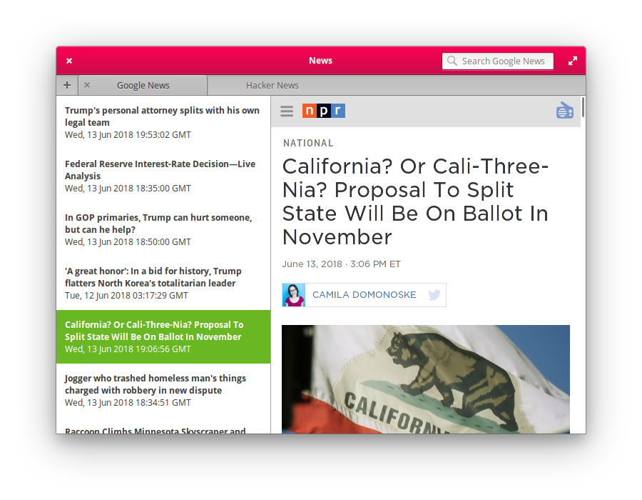

# news
A news viewer for elementary os



# Installation
## On elementary OS?

<!--a href="https://appcenter.elementary.io/com.github.allen-b1.news"></a-->
See the building instructions below.

## Not on elementary OS?
Download [`install.sh`](https://raw.githubusercontent.com/Allen-B1/news/master/install.sh) and execute it.

# Building
Make sure that `elementary-sdk` is installed.

```bash
git clone https://github.com/allen-b1/news.git
cd news
cmake /usr ./
make
sudo make install
```
