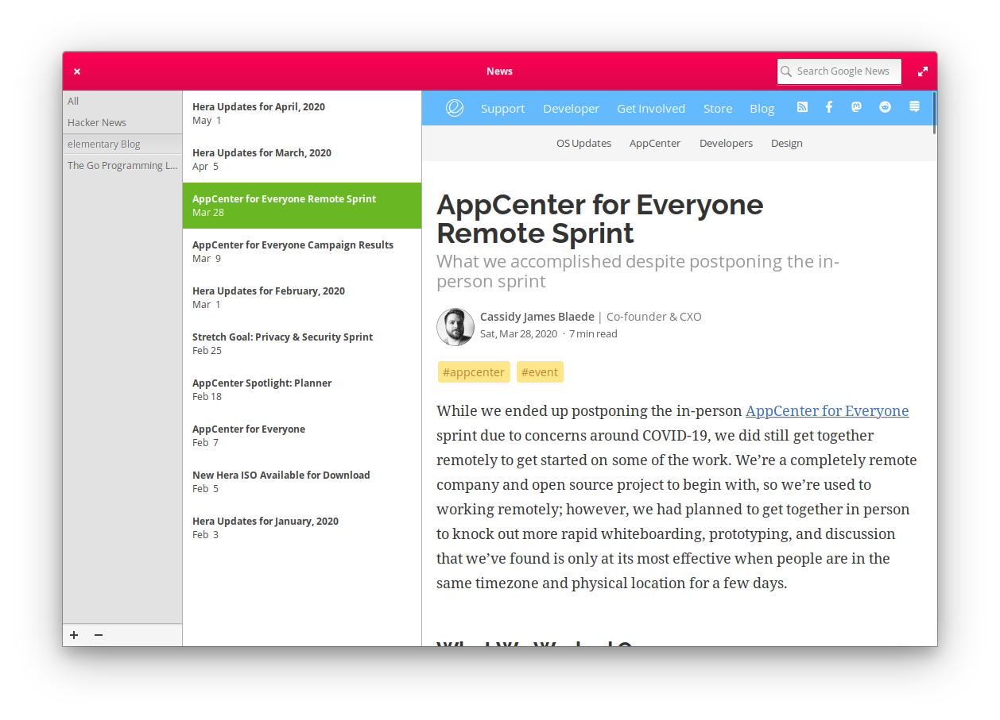

# com.github.allen-b1.news
A news viewer for elementary os



## Installation
### On elementary OS?

<a href="https://appcenter.elementary.io/com.github.allen-b1.news"></a>

## Notes
A big thanks to [mirkobrombin](https://github.com/mirkobrombin) for designing the icon  


## Building
Make sure that `elementary-sdk` is installed.

```bash
git clone https://github.com/allen-b1/news.git
cd news
mkdir build
cd build
cmake ..
sudo make install
```
